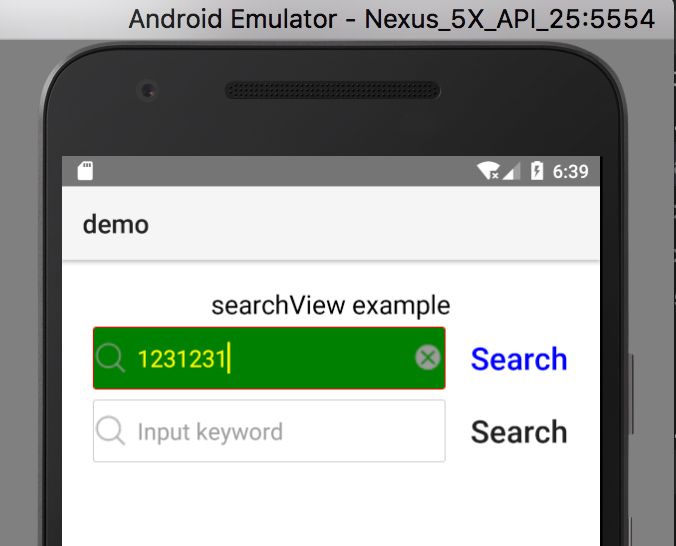

# nativescript-segment-view

A NativeScript plugin to extend segmentBar, make style same in android and ios.

## Sample Screenshots

#### Android

Sample 1
--------



#### iOS

Sample 1
--------


## Installation

```javascript
tns plugin add nativescript-search-view
```

## Usage 

### XML
```XML
<Page xmlns="http://schemas.nativescript.org/tns.xsd" loaded="pageLoaded" class="page"
  xmlns:ui="nativescript-search-view">
  <StackLayout class="p-20">
    <Label text="{{ message }}" class="t-20 text-center c-black" textWrap="true"/>
    <ui:SearchView  loaded="svLoaded" hint="Input keyword" clear="onClear" submit="onSubmit"
      btnClick="onBtnClick"
      cancelButtonText="Search"
      searchBarIcon="~/images/search.png"
      clearIcon="~/images/clear.png"
      style="corner-radius:2.0;border-width:1;border-color:#FF0000;search-field-cursor-color:#FFFF00;search-field-text-color:#FFFF00;
    search-field-background-color:green;placeholder-color:#FFFF00;cancel-button-text-color:blue;" />
    <ui:SearchView  loaded="svLoaded" hint="Input keyword" clear="onClear" submit="onSubmit"
      btnClick="onBtnClick" style="corner-radius:2.0;border-width:1;border-color:#CCCCCC;" />
  </StackLayout>
</Page>
```

## Angular NativeScript

the app.module.ts of your app

```TS
import { NativeScriptSearchViewModule } from "nativescript-search-view/angular";
...
@NgModule({
    imports: [
        ...
        NativeScriptSearchViewModule,
        ...
    ]
    ...
})
export class AppModule { }
```

```XML
<SearchView id="1" (loaded)="onLoad()" (clear)="onClear()" (submit)="onSubmit($event)"
    (btnClick)= "onBtnClick($event)"
    cancelButtonText="Search"
    searchBarIcon="~/images/search.png"
    clearIcon="~/images/clear.png"
    style="orner-radius:2.0;border-width:1;border-color:#FF0000;search-field-cursor-color:#FFFF00;search-field-text-color:#FFFF00;
    search-field-background-color:green;placeholder-color:#FFFF00;cancel-button-text-color:blue;"></SearchView>
```
    
## License

Apache License Version 2.0, January 2004
